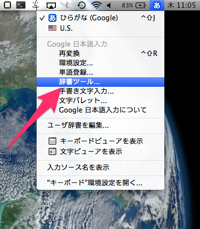
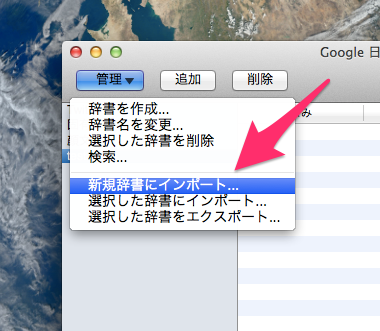
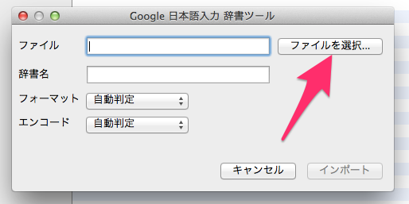
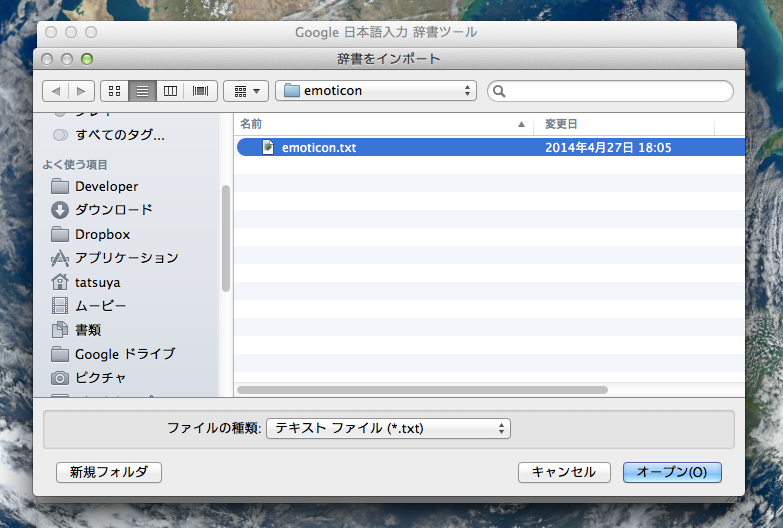

emoticon
========

Google日本語入力の顔文字辞書を管理するレポジトリです

# 使い方

[Google日本語入力](http://www.google.co.jp/ime/) がすでに導入されている前提で話を進めます．

好きなフォルダにリポジトリをcloneしてください．

```
git clone https://github.com/tiwanari/emoticon.git
```

## Macの場合 (Windows,Linuxでも同様の操作です)
日本語入力に切り替えた後，メニューバーから「辞書ツール」を選択します．


すると，辞書ツールが開くので，左上の「管理」ボタンから「新規辞書にインポート」を選択します．

**辞書を更新する場合は，「選択した辞書にインポート」を選択してください．**



開いたウィンドウで，ファイルの選択を押します．



ここで，cloneしたリポジトリの「emoticon.txt」を選択します．



先ほどの画面に戻るので，辞書名を入力して，「インポート」を行います(「フォーマット」と「エンコード」は，「自動判定」で構いません)．

### emoticon.txt を日本語順に並び替えたい場合（新規追加後など）
「sort_emoticon.py」をダウンロードし、「emoticon.txt」と同じ場所に持ってきます。以下のコマンドを実行します。
```
python sort_emoticon.py
```
おしまい╭( ･ㅂ･)و ｸﾞｯ!

# その他
- 顔文字を検索する CLI ツールをつくっていただきました！ [fand/kao](https://github.com/fand/kao)

# License
MIT
